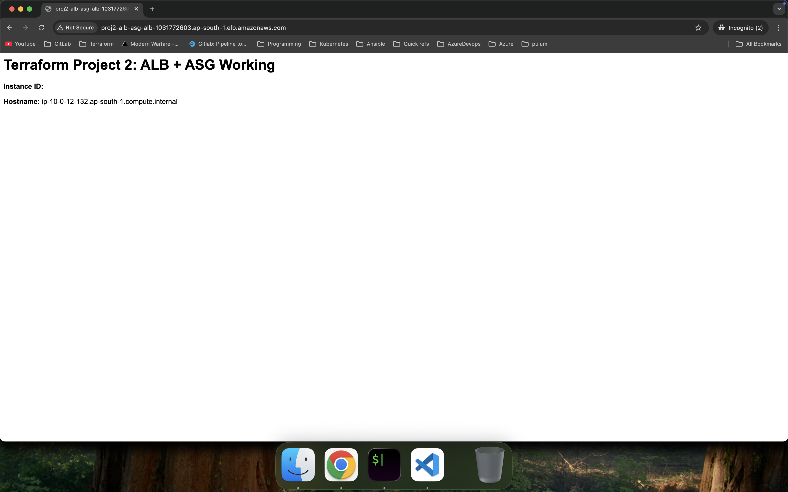
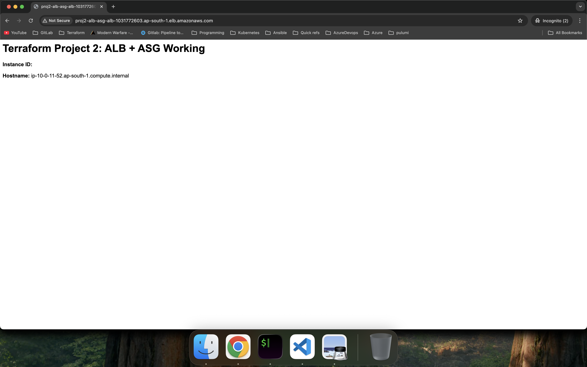

# AWS ALB + Auto Scaling Group using Terraform

This project deploys a highly available AWS architecture using Terraform.

## Services Used
- VPC
- Public and Private Subnets
- Internet Gateway
- Security Groups
- Application Load Balancer
- Target Group
- Launch Template
- Auto Scaling Group
- EC2 instances with nginx

## Architecture Flow
User -> ALB -> Target Group -> EC2 Instances

## Terraform Files
- providers.tf
- variables.tf
- main.tf
- outputs.tf

## Commands
terraform init
terraform plan
terraform apply
terraform destroy

# AWS ALB + Auto Scaling Group using Terraform

# Infrastructure Components

The following AWS resources are created using Terraform:

VPC – Custom Virtual Private Cloud

Public Subnets – For the Application Load Balancer

Private Subnets – For EC2 instances

Internet Gateway – Enables internet access for public resources

Security Groups – Controls inbound and outbound traffic

Application Load Balancer (ALB) – Distributes traffic across instances

Target Group – Routes requests from ALB to EC2 instances

Launch Template – Defines EC2 configuration

Auto Scaling Group (ASG) – Automatically manages EC2 instances

EC2 Instances – Running Nginx web server

## Key Concepts Demonstrated

Infrastructure as Code using Terraform

AWS Application Load Balancer

Auto Scaling Groups

Launch Templates

High Availability Architecture

Traffic Distribution across EC2 instances

Automated Web Server Deployment using user_data
           

## Load Balancing Verification

The Application Load Balancer distributes incoming traffic across multiple EC2 instances.

### Response from Instance 1

### Response from Instance 2

Refreshing the browser returns different hostnames, demonstrating that the Application Load Balancer distributes traffic across instances in the Auto Scaling Group.

# Architecture Diagram

                Internet
                    |
                    |
            +-------------------+
            | Application Load  |
            |     Balancer      |
            +-------------------+
                    |
                    |
               Target Group
                    |
        -----------------------------
        |                           |
+-------------------+       +-------------------+
|   EC2 Instance    |       |   EC2 Instance    |
|      (Nginx)      |       |      (Nginx)      |
+-------------------+       +-------------------+
         \                         /
          \                       /
           +---------------------+
           |   Auto Scaling      |
           |       Group         |
           +---------------------+
